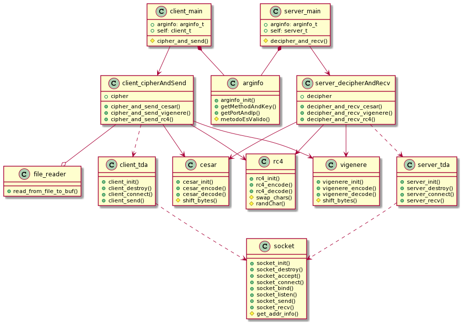

# Taller de Programación I - Cátedra Veiga - FIUBA
# Trabajo Práctico I 

<h2 align="right">Jonathan David Rosenblatt</h2>
<h2 align="right">104105</h2>

## Introducción

Este es el primer trabajo práctico de la materia en el que se debe entregar un producto programado y documentado. El mismo fue programado en C y requiere conocimientos introductorios en redes y criptografía. Un objetivo de este tp es nivelar la capacidad de programación en C del alumnado, adquiriendo buenas prácticas y escribiendo buen código en el camino.

## Configuración del Código Fuente

Para configurar y ejecutar el código lo primero que se debe hacer es clonar el repositorio. Luego para compilar y enlazar se debe ejecutar el Makefile incluido (ejecutando ```make``` ). En caso de tener errores con el compilador o el enlazador se verán escritos por stderr.

Primero se debe ejecutar el servidor:

```
./server <SERVER-PORT> --method=<METHOD> --key=<KEY>
```

Y luego el cliente:

```
./client <SERVER-HOST> <SERVER-PORT> --method=<METHOD> --key=<KEY>
```

Siendo:

- ```<SERVER_HOST>```: La dirección IPV4 de la persona ejecutando el servidor.
- ```<SERVER-PORT>```: El puerto que el servidor utilizará para comunicarse con el cliente.
- ```<METHOD>```: Método con el que se va a encriptar (caso cliente) y desencriptar el mensaje (caso servidor).
- ```<KEY>```: Llave con la que se va a encriptar y desencriptar el mensaje. 

Aclaración: el mensaje que reciba el servidor tendrá sentido solo si el método y clave ingresados en ambas puntas coinciden. Pueden ingresarse valores diferentes pero la llegada muy probablemente no tenga ningún sentido.

## Diseño

<br><p align="center"></p> 

## Buenas Prácticas

## Redes

## Herramientas Utilizadas

Las herramientas más utilizadas en este tp fueron:

- ***Valgrind***: el glorioso programa que tanto nos ayuda a debuggear el código. Con flags como ```--track-origins=yes``` para ver donde se nos generan variables no inicializadas que puedan causar problemas y ```--track-fds=yes``` para ver si nos quedaron sockets sin liberar (y donde fueron creados en caso de ser necesario). 

- ***Gdb***: el debugger de GNU, súper útil para revisar con detalle el código y encontrar más facilmente la causa de problemas como segmentation faults, loops infinitos, entre otros.

- ***Tiburoncín***: un software muy bueno para verificar como los datos se mandan del cliente al servidor. De especial utilidad para verificar que lo que sale del cliente llega como debería al servidor.

## Conclusión

Este tp resultó ser bastante exigente y personalmente tuve que dedicarle muchas horas de trabajo.

La parte de criptografía requiere un inmenso cuidado a la hora de escribir y testear el código. Lo mismo ocurre con la parte de redes, donde uno debe sentarse a leer la extensa documentación involucrada en todas las funciones que debemos utilizar.

Como dije en la introducción y en otras partes del trabajo, se aprenden muchas cosas súper interesantes y útiles como el manejo inteligente del stack en C, criptografía básica, conocimientos de redes, prácticas desarrollando TDA's, etc.
